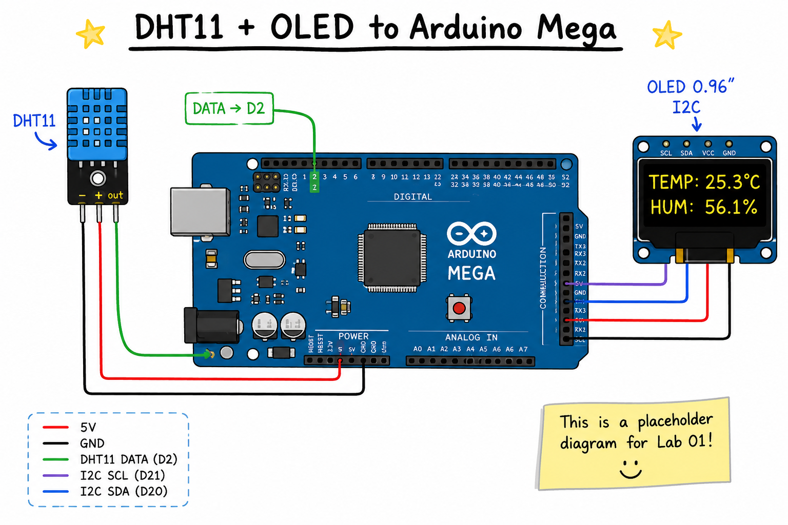

# Lab 01 - DHT11 and OLED Display

Display the current temperature and humidity on an OLED using a DHT11 sensor.

---

## Wiring Diagram



---

## Example Finished Project


---

## Hardware

- Arduino Mega 2560
- DHT11 Temperature/Humidity Sensor
- 0.96" I2C OLED Display
- Breadboard
- Jumper Wires

---

## Libraries

Install with the Arduino Library Manager:

- Adafruit GFX Library
- Adafruit SSD1306
- DHT sensor library by Adafruit

---

## Wiring

### DHT11

| DHT11 | Arduino Mega |
| ----- | ------------ |
| VCC   | 5V           |
| GND   | GND          |
| DATA  | D2           |

### OLED

| OLED | Arduino Mega |
| ---- | ------------ |
| VCC  | 5V           |
| GND  | GND          |
| SDA  | 20           |
| SCL  | 21           |

---

## Upload

Open `DHT11_OLED.ino` in the Arduino IDE and upload to your Arduino Mega.

Expected display:

```
T: 74.2°F

H: 43.2%
```
